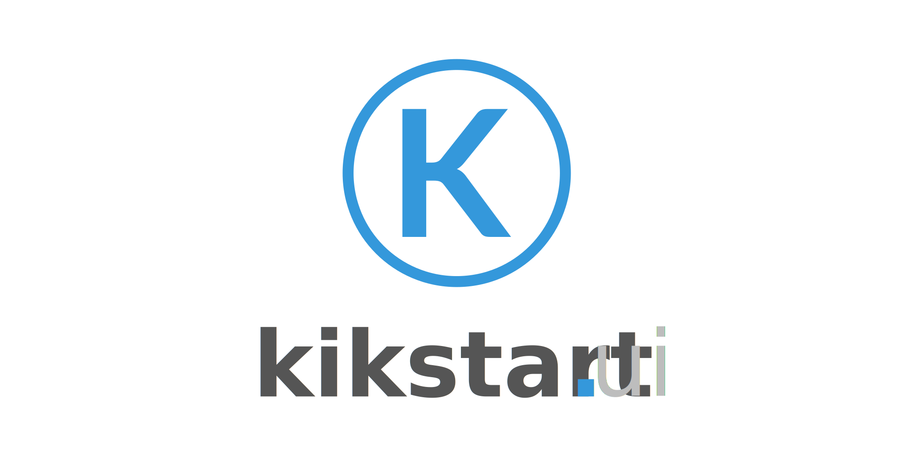

# kikstart.dev ui

> Set of ready to use declarative Angular UI components.

## Work in progress...

## Installation

```
# Create new app, or use existing...
ng new my-app --routing --style scss
cd my-app
# Install library
yarn add @kikstart/ui
# Install dependencies
yarn add bootswatch bootstrap font-awesome ngx-timeago ngx-bootstrap ngx-toastr @ngx-formly/core @ngx-formly/bootstrap
```

Update `src/styles.scss`:

```scss
@import '~@kikstart/ui/_styles.scss';
```

# MIT License
